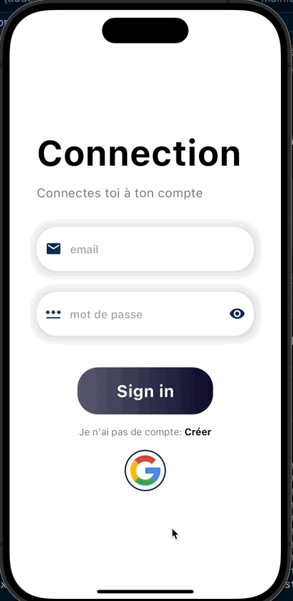

<h1 align="center"> 👥 User Management 📱 </h1> <br>
<p align="center">
    
</p>

<p align="center">
  Une application flutter qui gère des permissions d'utilisateurs
</p>

</br>

<div align="center">
    
[](https://app.netlify.com/sites/user-management-flutter/deploys)

[](https://codemagic.io/apps/6640f396b256ee08556aadc4/6640f396b256ee08556aadc3/latest_build)

</div>

## 👨🏻‍🏫 Le sujet Epitech

#### 📋 Prérequis

- **Version Flutter**: Votre code doit être au minimum sur Flutter 3.19.3 (canal stable).
- **Règles de lint**: Utilisez les règles de lint spécifiées ici: [Blackfoot Flutter Lint](https://pub.dev/packages/blackfoot_flutter_lint) dans votre fichier `analysis_options`.
- **Fonctionnalité**: Votre projet doit être fonctionnel.
- **Téléchargement**: Nous devons pouvoir télécharger au moins la version release pour Android et la version debug pour iOS. Utilisez les moyens que vous souhaitez pour le rendre téléchargeable (Codemagic, Firebase App Distribution, Diawi, TestFlight, les stores directement, etc.).
- **Accessibilité Web**: Nous devons pouvoir accéder à la partie web de votre projet en ligne.
- **Gestion des utilisateurs**: Système de login, d'inscription, avec photo de profil dans les infos utilisateur.
- **Types d'utilisateurs**: Au moins deux types (admin et utilisateur normal) avec des fonctionnalités différentes.
- **Fonctionnalité native du téléphone**: Utilisez au moins une (appel téléphonique, caméra, GPS, gyroscope...).
- **Fonctionnalité native web**.
- **Compatibilité**: Votre app doit fonctionner sur Android, iOS et le Web (responsive).
- **Gestion d'état global**: Utilisez Redux, BloC, Provider, GetX, etc.
- **Animation explicite**.

#### 🎁 Bonus

- **CI/CD** pour automatiquement tester et déployer votre app
- **Tests** pour votre app (unitaire / de widgets et/ou d'intégration)
- **Deploy** votre app sur les stores
- **Monitoring** en place pour votre app (pour les KPIs et/ou informations de crash)

## 👨🏽‍💻 Notre projet

Nous avons élaboré un projet simple mais complet, conçu pour valider tous les critères obligatoires du sujet tout en intégrant quelques fonctionnalités supplémentaires pour obtenir des points bonus. Notre application inclut des tests unitaires, des tests de widgets, et des tests d'intégration.

#### 🚀 Démarrage et Navigation

Le projet démarre sur une page de chargement animée qui introduit l'utilisateur à l'interface principale. Cette animation soignée guide l'utilisateur vers une page de connexion où il peut se connecter avec son email et mot de passe, ou s'inscrire s'il s'agit de sa première visite. Une authentification via Google est également mise en place pour simplifier l'accès.

#### 🏠 Page d'Accueil

Une fois authentifié, l'utilisateur est redirigé vers la page d'accueil. Cette page comporte deux boutons principaux :
Un bouton accessible à tous les utilisateurs qui active une fonctionnalité native du téléphone : la vibration.
Et un bouton exclusif aux administrateurs qui permet de déclencher une notification.

#### 👤 Page de Profil et Personnalisation

La page de profil offre aux utilisateurs la possibilité de gérer leurs préférences personnelles, telles que l'activation du mode sombre. Cette fonctionnalité est gérée via un système global de gestion d'état Getx, assurant une expérience utilisateur fluide et réactive.

#### 🛠 Fonctionnalités Techniques

Les Tests Unitaires et d'Intégration Patrol assurent que les composants fonctionnent correctement isolément et ensemble.
L'authentification Google permet une connexion rapide et sécurisée.
L'utilisation de capacités natives du téléphone et du navigateur web telles que la vibration (seulement pour le téléphone) et les notifications pour enrichir l'expérience utilisateur.
Cette application vise non seulement à satisfaire les exigences techniques du projet mais aussi à offrir une expérience utilisateur agréable et fonctionnelle.


## 🏗️ Architecture et technos
</br>
<div align="center">
  
  
  
</div>
</br>

<div align="center">
    
  cloud_firestore: ^4.16.1
  
  cupertino_icons: ^1.0.6
  
  firebase_auth: ^4.19.1
  
  firebase_core: ^2.29.0
  
  firebase_storage: ^11.7.5
  
  flutter_local_notifications: ^17.1.0
  
  get: ^4.6.6
  
  google_sign_in: ^6.2.1
  
  image_picker: ^1.1.1
  
  universal_html: ^2.2.4
  
  vibration: ^1.7.4

Pour les packages utilisés rien de bien compliqué, on retrouve firbase, firestore et google pour la gestion utilisateur, cupertino pour les icons. Nous utilisons vibration pour le bouton de tous les users, flutter_local_notifications pour le bouton admin afin de créer une notifications systeme, et universal_html pour détecter si nous sommes bien sur une version web afin d'y déclencher une notification adaptée à la version web grace au service worker. Nous avons aussi utilisé GetX pour gérer la partie state management et enfin image_picker afin de pouvoir changer de photo de profil et d'accéder aux photos du user.
</div>


## 🖥️ Notre solution
<p align="center">
    
    ---
    
    ---
    
    ---
</p>

## 📉📈 Déployer localement

Cloner le projet depuis GitHub :
```bash
git clone https://github.com/valoup917/user_management.git
```
Accéder au répertoire du projet :
```bash
cd user_management
```
Installer les dépendances du projet :

```bash
flutter pub get
```
Lancer le projet sur le device de votre choix:
```bash
flutter run
```
